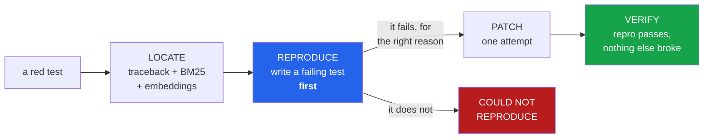

<h1 align="center">trace-to-patch (Python · ast · BM25 · embeddings · Ollama)</h1>
<p align="center"><i>A failing test to a verified patch — or an honest "could not reproduce"</i></p>

<p align="center">
  <a href="#the-through-line">The through-line</a> &middot;
  <a href="#the-result">The result</a> &middot;
  <a href="docs/RESULTS.md">Full results</a> &middot;
  <a href="#how-it-works">How it works</a> &middot;
  <a href="#run-it">Run it</a> &middot;
  <a href="#what-this-does-not-do">What it does NOT do</a> &middot;
  <a href="#problems-hit-while-building-this">Problems hit</a>
</p>

<p align="center">
  <a href="https://github.com/hammasbuilds/trace-to-patch/actions/workflows/ci.yml"></a>
  
  
  
  
  <a href="LICENSE"></a>
</p>

---

## The through-line



The reproduction is written **before** any fix is attempted, and it is the only reason a
verdict here means anything. Without it, "the suite went green" has two readings and no way
to tell them apart: the bug is fixed, or the patch deleted the code path that was failing.

> **A bug nobody can reproduce is a bug nobody should be patching.**

## The result

I pitched this as *"stack trace → patch"*. Before writing any of it, I injected 25
single-point bugs into a real library and looked at what its own suite actually reports:

```
56%  a traceback naming a library file
44%  a bare assertion in the test - ZERO library frames
```

**Almost half the time there is no trace at all.** A logic bug returns a wrong value; it
does not raise, so nothing inside the library ever appears in a frame. The premise of the
pitch held 56% of the time.

Then, with both retrieval arms running:

| signal | n | r@1 | r@3 | r@10 |
|---|---:|---:|---:|---:|
| **traceback** | 14 | 35.7% | 42.9% | 64.3% |
| **bare assertion** | 11 | **45.5%** | 63.6% | **90.9%** |

**A traceback leaves you worse off.** Ten points behind at rank 1, twenty-six behind at rank
10, against a failure that gave you nothing but a test name.

The reason is not that the traceback is noise. It is that a traceback names **where
execution stopped**, and that is a different place from where the mistake was made. A wrong
value surfaces in the test written for the very function that computed it; a crash surfaces
wherever the bad value finally met something that could not cope with it.

### What does *not* explain it

The obvious story — crashes come from deep utilities, whose breakage surfaces far from the
cause — was measured, and it is **wrong**:

| | n | median tests broken | max |
|---|---:|---:|---:|
| localised | 16 | 2 | **27** |
| missed | 9 | 2 | 4 |

The deepest bug in the set breaks 27 tests and was found at rank 3. What the misses share is
not depth but a **name**: `curry.__eq__`, `num_pos_args`, `check_partial`, `juxt.__init__` —
no test in the suite is named after any of them. Lexical retrieval is, to a first
approximation, a test-naming-convention detector, and the embedding arm is what covers the
functions that convention misses.

See [docs/RESULTS.md](docs/RESULTS.md) for the full run.

## How it works

**Locate.** Three signals, fused by reciprocal rank — which needs no shared scale, and BM25
scores, cosine similarities and "it appeared in the traceback" have none. The traceback arm
is nearly free and available just over half the time; BM25 over function source catches
`test_merge_sorted → merge_sorted`; embeddings catch the functions nobody named a test after.

**Reproduce, before fixing.** A generated test has to clear two bars: it must *fail* against
the current code, and it must fail **for the stated reason**. A test that errors on its own
bad import also "fails", and would then "pass" after any edit whatsoever. Anything short of
both bars is `could not reproduce`, which is an outcome rather than an error.

**Patch, once.** `code-llm-lab` measured self-debug loops capturing 100% of their gain by
round two, and 93.3% of first-attempt failures surviving both repair and rewrite. A second
attempt at the same broken function buys close to nothing. A refused patch stays refused and
says why.

**Verify, three ways.** The reproduction now passes; no test that was green is red; and the
patch stayed inside the one function it was given — a model asked to fix `merge_sorted` will
sometimes rewrite its neighbour too, and an unreviewed change is not a fix even when the
suite is green. The tree is restored unless all three hold.

## Run it

```bash
git clone https://github.com/hammasbuilds/trace-to-patch
cd trace-to-patch
uv venv && uv pip install -e ".[dev]"

# fix whatever is currently red
trace-to-patch fix /path/to/repo

# measure every stage against known answers
trace-to-patch bench /path/to/repo --limit 45

# localisation only - no language model at all
trace-to-patch bench /path/to/repo --locate-only --no-embeddings
```

`--locate-only --no-embeddings` is pure stdlib and needs nothing running. The full pipeline
needs Ollama with `qwen2.5-coder:14b`, and `nomic-embed-text` for the semantic arm.

## Layout

```
src/trace_to_patch/
  failure.py         run the suite; read the traceback, or notice there is not one
  locate/retrieval.py BM25 + embeddings + traceback frames, fused by reciprocal rank
  reproduce.py       write a failing test first, and check it fails for the right reason
  patch.py           one attempt, then three checks, then restore unless all three hold
  bench.py           inject bugs and keep the answer, so every stage is measurable
  types.py           Failure, Candidate, Attempt - and the Signal split the tool turns on
```

## What this does NOT do

- **It does not fix what it cannot reproduce.** That is the point, not a gap.
- **It does not prove a patch correct.** It proves the reproduction passes and nothing that
  was green went red. Those are weaker claims, and they are the ones actually checked.
- **One repository, 25 injected bugs**, split two ways. The direction of the traceback
  result held across every configuration run; the exact percentages are not tight.
- **Injected bugs are not human mistakes.** A flipped comparison is a proxy for a real bug.
- **The patch stage is unmeasured so far.** The published run is `--locate-only`; the GPU
  was busy with another measurement, and reporting a patch rate from a handful of cases
  would be worse than reporting none.

## Problems hit while building this

Every one of these is the same species: **a rule that silently did nothing, or a number that
was confidently wrong**, rather than anything that crashed.

- **The premise was wrong, and so was the measurement that checked it.** My first probe said
  52% of bugs crash. It classified failures by matching `/\w*(Error|Exception)/` on pytest's
  output — and `AssertionError` contains "Error", so every ordinary assertion failure
  counted as a crash. The real figure is 56%, and the whole tool is built around that split,
  so publishing the first number would have been building on sand. A test now pins it.
- **The tokenizer's camelCase branch could never fire.** It lowercased the text before
  looking for capitals. Retrieval would have quietly degraded on any camelCase codebase, and
  nothing would ever have pointed at it.
- **The benchmark scored the locator on impossible tasks.** It injected bugs into methods
  and recorded them as the answer, while the index only ever held module-level functions —
  so those cases could not be found by construction. Methods are indexed as `Class.method`
  now, and patched with the indentation put back.
- **It also scored bugs injected into `examples/`.** Not library code, three cases out of
  twenty-eight, and no reasonable locator should be marked down for them. Membership is now
  decided by whether the directory is a package.
- **My explanation for the headline was wrong.** I had a tidy story about crashes coming
  from deep utilities. Measuring blast radius refuted it: the deepest bug in the set was
  found at rank 3, and the misses were no deeper than the hits. The story in the README now
  is the one the data supports.

## Also worth reading

| | |
|---|---|
| &#128202; **[Results](docs/RESULTS.md)** | The full run, with the refuted hypothesis included |
| **[repo-surgeon](https://github.com/hammasbuilds/repo-surgeon)** | The same discipline pointed at migrations: it refuses what it cannot prove |
| **[pr-referee](https://github.com/hammasbuilds/pr-referee)** | A reviewer that only reports what it can prove, measured against an LLM reviewer |
| **[swebench-localization](https://github.com/hammasbuilds/swebench-localization)** | Where the retrieval approach came from — issue text to file, scored by recall@k |

## Keywords

fault localization &middot; automated program repair &middot; debugging &middot; failing
test &middot; stack trace &middot; traceback &middot; pytest &middot; BM25 &middot; hybrid
retrieval &middot; reciprocal rank fusion &middot; embeddings &middot; mutation testing
&middot; local LLM &middot; Ollama &middot; qwen2.5-coder &middot; reproducible benchmarks

## License

MIT - see [LICENSE](LICENSE).
